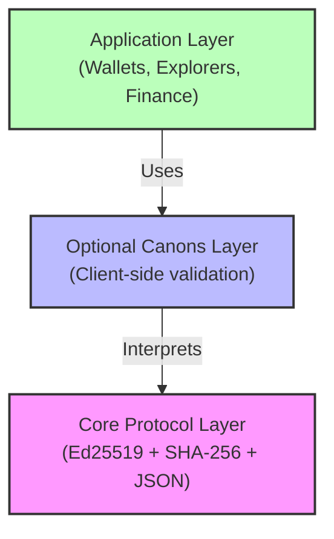
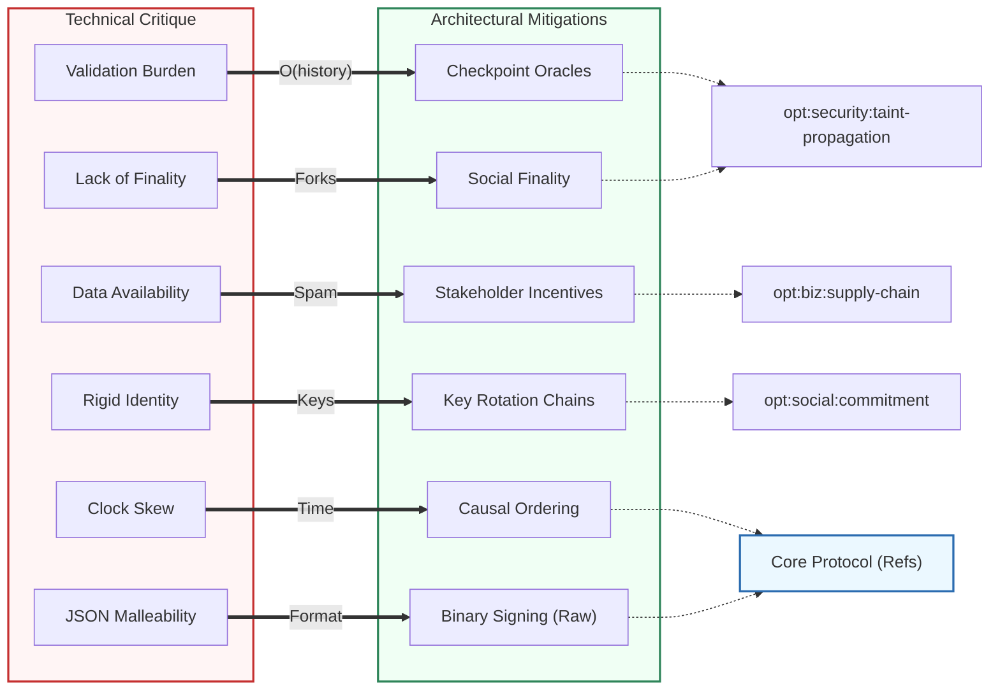

# Winter Solstice Genesis 2025

2025 Edition

---

## 1. Overview

**Genesis time:** 2025-12-21T15:03:00 UTC (Unix timestamp: 1766329380)

**Hash function:** SHA-256 (FIPS 180-4)

**Signature scheme:** Ed25519 (RFC 8032)

**Serialization:** JSON

**Keywords:** The key words "MUST", "MUST NOT", "SHOULD", and "MAY" in this document are to be interpreted as described in RFC 2119.

---

## 2. Serialization Format

```json
{
  "id": "hex64",
  "zone": "hex64",
  "subject": "hex64",
  "canon": "hex64",
  "time": integer,
  "refs": ["hex64", ...],
  "proof": "hex128"
}
```

| Data                | Encoding                      |
| ------------------- | ----------------------------- |
| Hashes, public keys | lowercase hex, 64 characters  |
| Signatures          | lowercase hex, 128 characters |
| Time                | Unix seconds (integer)        |
| Time (binary)       | 8 bytes, big-endian           |
| Refs delimiter      | `\|` (0x7C)                   |

---

## 3. Computation

### Attestation ID

```text
attestation_id = SHA-256(zone || subject || canon || BE64(time))
```

Input: 104 bytes (32 + 32 + 32 + 8)

### Refs Hash

```text
if len(refs) == 0:
    refs_hash = GLR
else:
    refs_hash = SHA-256(join(sort(refs), "|"))
```

Refs MUST be sorted lexicographically before hashing.

### Signature Input

```text
sign_input = attestation_id || subject || BE64(time) || refs_hash || canon
```

Total: 136 bytes (32 + 32 + 8 + 32 + 32)

---

## 4. Genesis Zone

The genesis zone is derived from GLR. The derivation is public — anyone can compute it. This is intentional: the genesis zone has no special authority after creating the first attestation.

```text
GLR           = e3b0c44298fc1c149afbf4c8996fb92427ae41e4649b934ca495991b7852b855
domain        = "glogos-genesis"
seed          = SHA-256(GLR || domain)
              = ae958e20ef38261f13a52590ee631ca83d718ea62d03f22774affd43c01bb902
public_key    = Ed25519_PublicKey_From_Seed(seed)
              = c70b1f7e4ce8cb7f6f8f3984ff6fe8260469b6cf8f8f839f047ba64d894d4be8
genesis_zone  = SHA-256(public_key)
              = db1756c17220873bcb831c2f9c197081ab0d83acf2226b819880d62ce906c010
```

---

## 5. Genesis Attestation

The Genesis Attestation is the deterministically derived root of trust for the Glogos protocol.

**Effective Date:** 2025-12-21T15:03:00 UTC (Winter Solstice)

**Canonical Artifact:** [`shared/artifacts/genesis-artifact.json`](./shared/artifacts/genesis-artifact.json)

---

## 6. Standard Canons

```text
canon_id = SHA-256(utf8(canon_name))
```

| Name                   | ID                                                                 | Purpose              |
| ---------------------- | ------------------------------------------------------------------ | -------------------- |
| `raw:sha256:1.0`       | `c794a6fc786ffc3941ec1a46065c4a94a97b6d548da7f8b717872f550619b327` | Raw data attestation |
| `timestamp:simple:1.0` | `5c25b519c7892bf36d29a1d3cabe62cd56ec8c9438032d574cacce7e0e8e94ba` | Timestamping         |
| `canon:definition:1.0` | `df4e66f5a2be89be05bae031aae388bc47ae51dedb4a863ee56228cc76f48265` | Define new canons    |

---

## 7. Optional Canons

Optional canons provide extended functionality. The core protocol stores all valid attestations; semantic validation is performed by clients that choose to support these canons.

**All optional canons are optional.** The protocol does not mandate any. Each zone may define its own.

### Architecture



| Layer               | Description                 | Responsibility                          |
| ------------------- | --------------------------- | --------------------------------------- |
| **Application**     | Wallets, Explorers, Finance | User-facing products, business logic    |
| **Optional Canons** | Client-side validation      | Interprets attestations, enforces rules |
| **Core Protocol**   | Ed25519 + SHA-256 + JSON    | Signing, hashing, serialization         |

### Naming Convention

```text
opt:{domain}:{type}:{version}
```

---

### Primary Examples

These canons are fully specified as reference implementations.

#### opt:finance:triple-entry:1.0

**Purpose:** Value transfer without blockchain consensus.

```json
{
  "asset": "IOU:USD:<issuer_zone>",
  "amount": 100000000,
  "from_zone": "<sender_zone_hex64>",
  "to_zone": "<recipient_zone_hex64>",
  "type": "transfer"
}
```

| Rule         | Description                                         |
| ------------ | --------------------------------------------------- |
| Double-spend | Core accepts both; client detects fork via refs DAG |
| Tie-breaker  | Lower `attestation_id` (lexicographic) wins         |
| Traversal    | `max_depth`: 1000; use checkpoints for scale        |
| Validation   | Unknown canon → raw; malformed → INVALID            |

#### opt:security:taint-propagation:1.0

**Purpose:** Reputation filtering via oracle subscriptions.

```json
{
  "target_zone": "<malicious_zone_hex64>",
  "severity": "critical",
  "category": "double-spend",
  "evidence": ["<attestation_id_hex64>"]
}
```

| Severity   | Client Action               |
| ---------- | --------------------------- |
| `info`     | Subtle indicator            |
| `warning`  | Yellow warning              |
| `critical` | Red alert, block by default |
| `banned`   | Hide completely             |

**Multi-oracle:** Users subscribe to multiple oracles; merge strategies: `most_severe`, `consensus`, `any`.

---

### Domain Examples

These are canon families for specific domains. Detailed specifications are defined by their respective communities.

| Domain        | Canon                          | Purpose                                              |
| ------------- | ------------------------------ | ---------------------------------------------------- |
| **Economics** | `opt:coord:rct:1.0`            | Randomized Controlled Trials (Banerjee/Duflo/Kremer) |
|               | `opt:coord:matching:1.0`       | Stable allocations (Roth/Shapley)                    |
|               | `opt:coord:liquidity:1.0`      | Proof-of-reserves (Diamond/Dybvig)                   |
| **Media**     | `opt:media:art:1.0`            | Art provenance and ownership                         |
|               | `opt:media:poetry:1.0`         | Literary attribution                                 |
| **Science**   | `opt:science:data:1.0`         | Dataset integrity                                    |
|               | `opt:science:reproducible:1.0` | Peer-review chains                                   |
| **Social**    | `opt:social:commitment:1.0`    | Marriage, vows, life-long bonds                      |
|               | `opt:social:care:1.0`          | Non-monetary support attestations                    |
|               | `opt:social:gift:1.0`          | Pure gift without debt recursion                     |
| **Business**  | `opt:biz:transaction:1.0`      | B2B with proof-of-delivery                           |
|               | `opt:biz:governance:1.0`       | Shareholder voting (Ostrom/Williamson)               |
|               | `opt:biz:supply-chain:1.0`     | Raw material to consumer tracking                    |

---

## 8. Verification

```text
1. Parse JSON
2. Verify: zone == SHA-256(public_key)
3. Verify: id == SHA-256(zone || subject || canon || BE64(time))
4. Compute: refs_hash
5. Build: sign_input
6. Verify: Ed25519_Verify(proof, sign_input, public_key)
```

### CLI verification

```bash
printf '' | sha256sum
# e3b0c44298fc1c149afbf4c8996fb92427ae41e4649b934ca495991b7852b855

printf 'From nothing, truth emerges' | sha256sum
# 73c14a502ae8b0e3035ab28c1f379567343c47afed318c898978474398ebe042
```

### Test Vectors

See [`shared/test-vectors/protocol-vectors.json`](./shared/test-vectors/protocol-vectors.json) for implementation validation.

---

## 9. Network Membership

An attestation belongs to this network if it:

1. Uses SHA-256 and Ed25519 (or future quantum-resistant equivalents tracing back to GLR)
2. Uses JSON serialization as specified
3. Has refs tracing to GLR

---

## 10. Security Considerations

**Private Key Exposure:** The genesis private key is publicly derivable. This is by design; implementations MUST NOT reuse this pattern for user zones.

**Replay Prevention:** The time field combined with refs ordering prevents replay attacks. Implementations SHOULD reject attestations with time values in the future.

**Double-Spend:** The core protocol stores all valid attestations including conflicting ones. Double-spend detection is client responsibility via refs traversal.

**Signature Malleability:** Ed25519 signatures are non-malleable per RFC 8032. Implementations MUST verify canonical signature encoding.

---

## 11. Non-Guarantees

The core protocol explicitly does **NOT** provide:

| Not Provided                  | Reason                           | Alternative                      |
| ----------------------------- | -------------------------------- | -------------------------------- |
| Consensus on semantic meaning | Neutrality by design             | Client-layer validation          |
| Verified timestamps           | Self-reported, causal order only | Refs provide causal ordering     |
| Cross-client interoperability | Opt-in canons are hints          | Social coordination              |
| Authority hierarchy           | No zone has special privileges   | Oracle subscriptions             |
| Network isolation             | GLR is public                    | Attestations are portable facts  |
| Oracle discovery              | Out of scope                     | Social channels, directory zones |

> [!IMPORTANT]
> Opt-in canons are **coordination tools**, not enforcement mechanisms.
> Clients MAY interpret the same attestation differently.
> This is a feature, not a bug.

**Oracle discovery** is explicitly out of scope. Users discover oracles through:

- Social channels (documentation, communities)
- Directory zones (`opt:directory:oracle:1.0`)
- Existing trust relationships

---

## Appendix A: Technical Critique & Mitigations

Glogos is a **Logic Layer (L0)**. It prioritizes mathematical purity and neutrality, pushing complexity to higher layers.



| Critique              | Description                       | Mitigation                             | Implementation                   |
| --------------------- | --------------------------------- | -------------------------------------- | -------------------------------- |
| **Validation Burden** | Client must traverse full history | Checkpoint oracles reduce traversal    | `opt:security:taint-propagation` |
| **Lack of Finality**  | No consensus = forks possible     | Social finality via reputation oracles | `opt:security:taint-propagation` |
| **Data Availability** | Spam can bloat storage            | Stakeholder incentives to store        | `opt:biz:supply-chain`           |
| **Rigid Identity**    | Lost key = lost identity          | Key rotation chains                    | `opt:social:commitment`          |
| **Clock Skew**        | Self-reported time can be wrong   | Causal ordering via refs               | Core Protocol                    |
| **JSON Malleability** | JSON can have multiple encodings  | Sign raw bytes, not JSON               | Core Protocol (Section 3)        |

---

## Appendix B: JSON Schema

To ensure interoperability, all attestations MUST validate against this schema:

```json
{
  "$schema": "http://json-schema.org/draft-07/schema#",
  "type": "object",
  "required": ["id", "zone", "subject", "canon", "time", "refs", "proof"],
  "properties": {
    "id": { "type": "string", "pattern": "^[0-9a-f]{64}$" },
    "zone": { "type": "string", "pattern": "^[0-9a-f]{64}$" },
    "subject": { "type": "string", "pattern": "^[0-9a-f]{64}$" },
    "canon": { "type": "string", "pattern": "^[0-9a-f]{64}$" },
    "time": { "type": "integer", "minimum": 0 },
    "refs": {
      "type": "array",
      "items": { "type": "string", "pattern": "^[0-9a-f]{64}$" },
      "minItems": 0
    },
    "proof": { "type": "string", "pattern": "^[0-9a-f]{128}$" }
  },
  "additionalProperties": false
}
```

---

## Appendix C: Design Philosophy

### Entities as DAGs

Any entity — person, organization, IoT device — is a sub-graph of attestations:

- **People:** Identity = history of attestations over time
- **Business:** Brand = aggregate of satisfied refs
- **IoT:** Device authenticity = attestation chain from manufacturer
- **Reduced Friction:** Attestation-based proof minimizes transaction costs

### Beyond Data

Glogos coordinates not just trade, but connection:

- **Promises as a DAG:** A relationship is mutual attestations over time.
- **Proof of Devotion:** Referencing another zone binds identities.
- **Eternal Memory:** Commitments are as immutable as transactions.

### Truth and Accountability

Glogos is neutral — it does not evaluate truth. However:

1. **Permanence:** Lies cannot be erased from the DAG.
2. **Attribution:** Every attestation is tied to a zone.
3. **Opt-in Filtering:** Communities choose their truth oracles.

---

## Appendix Z: Cross-Network Interoperability

### Permissionless Bridges

GLR = SHA-256("") is the universal anchor. Any genesis can reference it.

```text
Network A --refs--> GLR
Network B --refs--> Winter Solstice 2025 --refs--> GLR
```

- **No permission needed:** Any network can ref any attestation
- **Bridges emerge naturally:** Cross-refs create inter-network DAG
- **From nothing, truth emerges** — the invitation is universal

---

_Sunday, December 21, 2025_
_Observed by Le Manh Thanh_

_License: [CC-BY-4.0](https://creativecommons.org/licenses/by/4.0/)_
